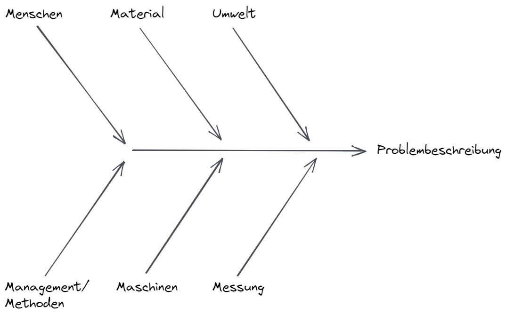

## 7 - Ursachenanalyse Methodenbaukasten 2

In diesem Abschnitt erprobst du mit deinem Team zwei weitere typische Ursachenanalysen. Ihr arbeitet euch also weiter an den Ursprung des Problems heran.

(siehe auch [Das Problem verstehen - Ursachenanalyse (D4)](1-0-Grundlagen.md#das-problem-verstehen---ursachenanalyse-d4))

### Kata 7.1 - Ursache-Wirkungs-Diagramm

(auch Fischgräten- oder Ishikawa-Diagramm, siehe auch den [Abschnitt in den Grundlagen](1-0-Grundlagen.md#das-problem-verstehen---ursachenanalyse-d4))

#### Beschreibung

In dieser Kata wirst du das Ursache-Wirkungs-Diagramm kennenlernen, ein weiters Werkzeug um den Ursachen eines Problems auf den Grund zu gehen.
Auch wenn ihr im vorherigen Abschnitt schon eine Ursache gefunden habt, versucht hier frisch und unvoreingenommen zu arbeiten. Es geht in diesem Lernpfad auch darum, die Methoden kennenzulernen und einzuüben.

#### Dauer

Etwa 30 Minuten für dich und dein Problemlösungsteam.

#### Ablauf

1. Bereite eine beschreibbare Wand (Metaplan-Wand, Whiteboard, Tafel, Packpapier auf einer Wand, …) vor und skizziere das Ursache-Wirkungs-Diagramm (siehe [Vorlage im Anhang dieses Abschnitts](#vorlage-f%C3%BCr-ein-ursache-wirkungs-diagramm)).
2. Alle im Team schreiben für sich auf einem Blatt Papier auf, welche Elemente auf die Entstehung des Problems einen Einfluss gehabt haben können.
3. Sortiert das, was ihr gefunden habt, den Elementen des Ursache-Wirkungsdiagramm zu. Die Elemente des Diagramms helfen euch auf zwei Arten
    1. Dadurch, dass ihr zuordnet, wird eine mögliche Ursache besser fassbar. Die Art und Weise des Umgangs damit wird klarer.
    2. Wenn ein Element signifikant geringer besetzt ist als die anderen Elemente, überlegt konkret, welche Ursachen es noch geben könnte, die diesem Element zugeordnet werden können.
    3. Für sehr komplizierte Systeme lassen sich zu den Ursachen noch Unterelemente finden. Diese können dann wieder Unterelemente haben und so fort. Das Diagramm wird dann irgendwann wie ein Baum oder ein Flusssystem aussehen.
4. Tretet zurück und lasst das Diagramm auf euch wirken. Was fällt euch auf? Ergibt sich ein Muster?
5. Stimmt darüber ab, welche der Ursachen ihr für wesentlich haltet (zum Beispiel mit einem “Dot-Voting”). Überlegt, wie ihr deren Einflüsse nachweisen und in Folge abstellen könnt.
6. Auch hier könnt ihr für das Auftreten und das Nicht-Entdecken eigene Diagramme aufbauen.

#### Vorlage für ein Ursache-Wirkungs-Diagramm

### Kata 7.2 -  Is/Is-Not

#### Beschreibung

In dieser Kata wirst du die “Is/Is-Not” Methode anwenden, ein weiteres typisches Werkzeug zur Ursachenanalyse. 

#### Dauer

Etwa 30 Minuten für dich und dein Problemlösungsteam.

#### Ablauf

1. Nehmt die Problembeschreibung aus dem [Abschnitt 2](2-02-beschreibe-dein-problem-ausfuehrlich.md#2---beschreibe-dein-problem-ausf%C3%BChrlich) und beschreibt ausführlicher
    1. **Was** ist das Problem?
    2. **Wo** trat es auf?
    3. **Wann** trat es auf?
    4. **Wer** ist beteiligt?
2. Als nächstes schaut euch vergleichbare Situationen an und fragt
    1. Welche ähnlichen Situation zeigen nicht das Problem?
    2. Was ist an den Orten, Bereichen, an denen das Problem nicht auftritt anders?
    3. Was ist an dem Zeitpunkt, an denen das Problem nicht auftritt anders?
    4. Was machen die beteiligten Personen anders, bei denen das Problem nicht auftritt?
3. Versucht weitere Aspekte zu finden, die für die problematische Situation einmalig ist, in ähnlichen Situationen aber nicht zum Problem führen.
4. Tretet zurück und lasst eure Faktensammlung auf euch wirken. Was fällt euch auf? Ergibt sich ein Muster? Welche Ursachen legt diese Analyse nahe?

### Kata 7.3 - Reflektion in der Lerngruppe

#### Beschreibung

In dieser Kata wirst du die ersten Ursachenanalysen reflektieren und durch Rückmeldungen aus deiner Lerngruppe die Art der Zusammenarbeit tiefer verstehen.

#### Dauer

Etwa 30 Minuten in deiner Lerngruppe.

#### Ablauf

1. Beschreibt reihum, wie es euch bei der Ursachenanalyse gegangen ist.
    1. Was war leicht oder gut? Was war schwer oder schlecht?
    2. Habt ihr den Eindruck, das Problem schon ausreichend zu verstehen? Woher stammt dieser Eindruck?
2. Reflektiert eure Teamarbeit
    1. Wie arbeitet das Team zusammen? Was funktioniert? Was nicht?
    2. Fehlt jemand im Team? Beteiligen sich alle Teammitglieder wie erwartet?
